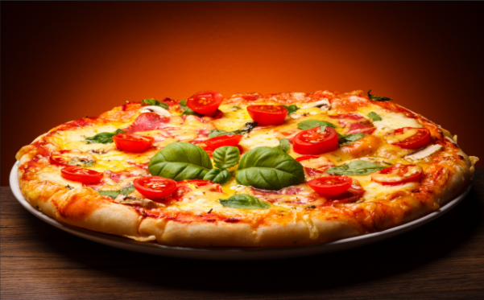

<!DOCTYPE html>
<html lang="en">
<head>
  <meta charset="UTF-8" />
  <meta name="viewport" content="width=device-width, initial-scale=1.0" />
  <title>Golden Slice | Pizza Service</title>
  <link rel="stylesheet" href="style.css" />
  <link href="https://fonts.googleapis.com/css2?family=Poppins:wght@400;600;700&display=swap" rel="stylesheet">

</head>

<body>
  <!-- Navbar -->
  <header class="navbar">
    
🍕 Golden Slice

    <nav>
      <a href="#home">Home</a>
      <a href="#services">Menu</a>
      <a href="#steps">How to Order</a>
      <a href="#reviews">Reviews</a>
      <a href="#about">About</a>
      <a href="#contact">Contact</a>
    </nav>
    <button class="order-btn" onclick="scrollToSection('contact')">Order Now</button>
  </header>

  <!-- Hero Section -->
  <section id="home" class="hero">
    

      <h1>Fresh. Hot. Golden.</h1>
      
Experience premium pizzas made with passion, baked to perfection, and delivered with love.

      <button onclick="scrollToSection('services')">Explore Menu</button>
    

  </section>

  <!-- Description / Why Us -->
  <section class="why-us">
    

      <h2>Why Choose Golden Slice?</h2>
      

        

          <h3>🔥 Fresh Ingredients</h3>
          
We use farm-fresh veggies and hand-tossed dough daily.

        

        

          <h3>⚡ Fast Delivery</h3>
          
Hot pizza at your door in under 30 minutes.

        

        

          <h3>💛 Great Deals</h3>
          
Save more with combo offers and daily discounts.

        

        

          <h3>🍴 Variety</h3>
          
Choose from over 20 pizzas with custom toppings.

        

      

    

  </section>

  <!-- Services (Menu) -->
  <section id="services" class="services">
    <h2>Our Great Deals</h2>
    

      

        
        <h3>Margherita</h3>
        
Classic cheese, tomato & basil

        $9.99
      

      

        
        <h3>Pepperoni</h3>
        
Loaded with crispy pepperoni

        $11.49
      

      

        
        <h3>Veggie Supreme</h3>
        
Fresh veggies with extra cheese

        $10.99
      

      

        
        <h3>BBQ Chicken</h3>
        
Smoky BBQ sauce with chicken

        $12.49
      

    

  </section>

  <!-- Ordering Steps -->
  <section id="steps" class="steps">
    <h2>How to Order</h2>
    

      

        <h3>1️⃣ Choose Your Pizza</h3>
        
Pick from our menu or customize your own.

      

      

        <h3>2️⃣ Place Your Order</h3>
        
Quick and easy checkout experience.

      

      

        <h3>3️⃣ Get It Delivered</h3>
        
Our delivery heroes bring it hot and fresh!

      

    

  </section>

  <!-- Customer Reviews -->
  <section id="reviews" class="reviews">
    <h2>What Our Customers Say</h2>
    

      

        
"Best pizza I’ve ever had! Crispy crust and perfect cheese blend."

        - Sarah J.
      

      

        
"Fast delivery and absolutely delicious! Highly recommend."

        - Mike D.
      

      

        
"Golden Slice never disappoints. Great quality and taste!"

        - Priya K.
      

    

  </section>

  <!-- About Us -->
  <section id="about" class="about">
    

      
      

        <h2>About Golden Slice</h2>
        
At Golden Slice, we believe every slice tells a story. Our chefs craft pizzas using traditional recipes with a modern twist. Whether dine-in or delivery, we promise freshness, flavor, and satisfaction in every bite.

      

    

  </section>

  <!-- Contact Us -->
  <section id="contact" class="contact">
    <h2>Contact Us</h2>
    <form id="contactForm">
      <input type="text" placeholder="Your Name" required>
      <input type="email" placeholder="Your Email" required>
      <textarea placeholder="Your Message" required></textarea>
      <button type="submit">Send Message</button>
    </form>
    

  </section>

  <!-- Footer -->
  <footer>
    
© 2025 Golden Slice | Designed with ❤️ and Cheese.

  </footer>

  
</body>
</html>

